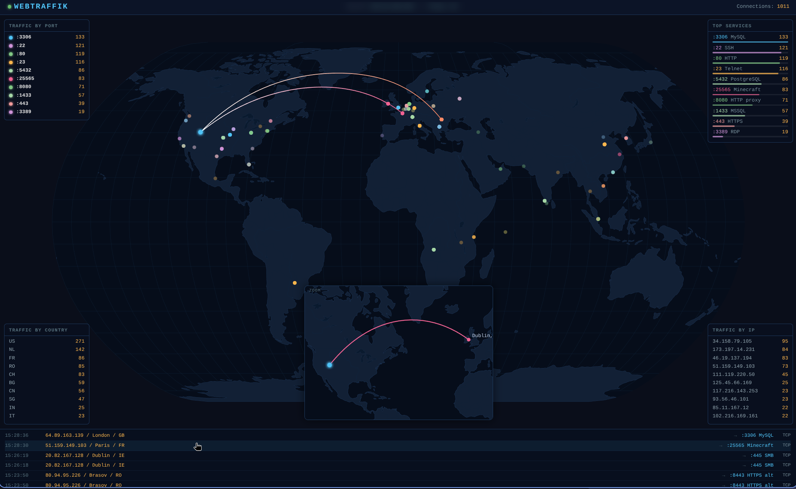

# webTraffik

A real-time network traffic sensor and visualization tool that captures incoming connections on common HTTP ports, TCP services (FTP, SSH, Telnet, SMTP, databases, etc.), and UDP ports, geolocates them using MaxMind GeoLite2, and renders them on an interactive D3.js world map with animated great-circle arcs.


## Features

- **Live Traffic Visualization**: Animated great-circle arcs showing connections from source to destination in real-time
- **Multi-Protocol Support**: Captures HTTP traffic (17 common ports), TCP service emulation (14 services including SSH, FTP, databases), and UDP traffic (DNS)
- **Automatic Geolocation**: MaxMind GeoLite2 City database with `rgeo` fallback for enhanced city-level accuracy
- **Dark-Themed D3.js Map**: Beautiful Natural Earth projection with optimized arc animations
- **Corner Overlay Panels**: Four transparent panels showing Traffic by Port, Top Services, Traffic by Country, and Traffic by IP — overlaid on the map for an unobstructed view
- **Historical Replay**: New dashboard connections receive the last 1000 events as faded static dots
- **SQLite Persistence**: Events survive service restarts; stored in `/var/lib/webtraffik/events.db`
- **Port-Based Color Coding**: Each monitored port gets a unique color in the legend and arc animations
- **Map Dot Tooltips**: Hovering over any source dot shows "City, CC" for that connection
- **Performance Optimized**: Gradient pooling, reduced path sampling, arc lifecycle capping, decoupled sidebar rendering with requestIdleCallback
- **Selective Port Disabling**: Skip individual ports at startup with `-disable-ports=22,80,443` to avoid conflicting with existing services on the host
- **Automated nftables Firewall**: Auto-configured on install — restricts management ports (SSH, dashboard) to your subnet while exposing capture ports to the internet
- **Zero Configuration**: Auto-downloads GeoLite2 database from GitHub mirror on first run (no license key needed)
- **Systemd Integration**: Runs as non-root user with `CAP_NET_BIND_SERVICE` capability for ports <1024
- **Cross-Platform**: Supports linux/amd64, linux/arm64, linux/armv6, linux/armv7, darwin, and windows

## Architecture

webTraffik listens on:
- **17 HTTP ports** (80, 8080, 8000, 8008, 8081, 8088, 8090, 8888, 3000, 3001, 3128, 4000, 4200, 5000, 5001, 9000, 9090)
- **14 TCP service ports** with protocol emulation (21/FTP, 22/SSH, 23/Telnet, 25/SMTP, 110/POP3, 143/IMAP, 443/HTTPS, 445/SMB, 1433/MSSQL, 3306/MySQL, 3389/RDP, 5432/PostgreSQL, 6379/Redis, 27017/MongoDB)
- **1 UDP port** (53/DNS)
- **1 TCP service port** for Minecraft Java Edition (25565)

The dashboard is served on port **8999** (management-only, restricted to your subnet by the firewall).

Traffic reaches the app via **pure NAT redirect** — your firewall forwards packets without injecting proxy headers, so `RemoteAddr` contains the original source IP.

The dashboard uses WebSocket for real-time event streaming. Each new connection receives:
1. **Historical events** (last 1000) replayed from the SQLite database as faded static dots
2. **Live events** as animated arcs that settle into persistent dots with city/CC tooltips

## Screenshot



The dashboard shows:
- A full-width world map with your server location marked in cyan
- Animated arcs from visitor IPs to your server (optimized with gradient pooling and 20-point path sampling)
- Persistent dots with mouseover tooltips showing "City, CC"
- Four corner overlay panels on the map:
  - **Top-left**: Traffic by Port (live port statistics sorted by count)
  - **Top-right**: Top Services (service names with bar charts showing relative traffic)
  - **Bottom-left**: Traffic by Country (top 10 countries by connection count)
  - **Bottom-right**: Traffic by IP (top 10 source IPs by connection count)
- A scrolling log panel at the bottom showing all connections with timestamps, geolocation details, and service names (e.g., `:22 SSH`, `:3306 MySQL`); click any entry to replay its arc on the map

## Quick Start

### Prerequisites

- **Go 1.21+** (for building from source)
- **Linux** (for systemd service) — also works on macOS/Windows for development
- **nftables** (for the automated firewall — Linux only)

### Build and Run Locally

```bash
# Clone the repository
git clone https://github.com/yourusername/webtraffik.git
cd webtraffik

# Build for your current platform
make build

# Run with capability (allows binding ports <1024 without root)
make cap
```

Visit http://localhost:8999 to see the dashboard.

### Install as systemd Service

On the target Linux machine:

```bash
make install
```

This will:
1. Build the binary
2. Create a system user `webtraffik`
3. Install to `/usr/local/bin/webtraffik`
4. Set `cap_net_bind_service` capability
5. Install and start the systemd service

Check logs with:

```bash
journalctl -u webtraffik -f
```

## Installation Methods

### Method 1: Local Install (requires Go and make)

```bash
make install
```

### Method 2: Remote Install via SSH

Build on your local machine and deploy to a remote host in one command:

```bash
make remote-install IP=1.2.3.4
```

This automatically:
- Detects the remote architecture
- Cross-compiles the correct binary
- Copies binary, install script, firewall script, and nftables template via SSH
- Runs the installer as root (which includes full firewall setup)

SSH connects as `$USER` — ensure your SSH key is configured on the remote host.

### Method 3: Manual Install (no Go/make on target)

For hosts without Go:

1. Build the binary for the target architecture:
   ```bash
   make dist
   ```

2. Copy to the remote host:
   ```bash
   scp dist/webtraffik_linux_amd64 user@host:webtraffik
   scp install.sh firewall.sh nftables.conf user@host:
   ```

3. Install on remote:
   ```bash
   ssh user@host
   sudo bash install.sh
   ```

## Makefile Targets

| Target | Description |
|--------|-------------|
| `make build` | Build for current OS/arch |
| `make dist` | Cross-compile for all platforms into `dist/` |
| `make run` | Build and run locally |
| `make cap` | Build, set `cap_net_bind_service`, and run |
| `make cap-dist` | Set capabilities on all Linux dist binaries |
| `make install` | Install binary + systemd service |
| `make remote-install IP=x.x.x.x` | Build, deploy, install, and configure firewall on remote host via SSH |
| `make firewall` | Re-apply nftables firewall ruleset on the local machine |
| `make uninstall` | Remove service, binary, user, data directory, and firewall config |
| `make clean` | Remove build artifacts and GeoLite2 DB |

## Firewall Configuration

webTraffik ships with `firewall.sh` and `nftables.conf`, which together configure an nftables DMZ policy automatically during installation.

### What the firewall does

- **Capture ports** (80, 8080, 8000, etc.) are **open to the internet** — these are the honeypot/sensor ports
- **Everything else** (SSH :22, dashboard :8999, any other service) is **restricted to your local subnet** — the subnet is auto-detected from the default route interface at install time
- The NAT prerouting rule redirects capture-port traffic to the app process

### How it is applied

`firewall.sh` runs automatically as part of `make remote-install` and `sudo bash install.sh`. It:
1. Auto-detects the primary network interface and its subnet via `ip route`
2. Substitutes `__SUBNET__` and `__CAPTURE_PORTS__` tokens in `nftables.conf`
3. Writes the generated ruleset to `/etc/nftables.d/webtraffik.conf`
4. Validates the ruleset with `nft -c` before applying
5. Enables and restarts the `nftables.service`

To re-apply without a full reinstall:

```bash
make firewall
# or
sudo bash firewall.sh
```

### Port sync requirement

**Important**: If you add or remove ports in `main.go` (HTTP ports in `capturePorts`) or `services.go` (TCP service ports in `tcpServices` or UDP ports in `udpServicePorts`), you must also update the corresponding variables in `firewall.sh` to match:
- `CAPTURE_PORTS_TCP` (around line 70) — must include all HTTP ports from `main.go` plus all TCP service ports from `services.go`
- `CAPTURE_PORTS_UDP` (around line 75) — must include all UDP ports from `services.go`

If you are disabling individual ports with `-disable-ports`, you must also pass them to `firewall.sh` via the `DISABLE_PORTS` environment variable:

```bash
sudo DISABLE_PORTS=22,443 bash firewall.sh
```

Then re-apply:

```bash
make remote-install IP=x.x.x.x
# or, on the server directly:
sudo bash firewall.sh
```

The dashboard port **8999** is intentionally excluded from the capture-port list and is protected by the subnet-only management rule.

### Inspect the active ruleset

```bash
nft list ruleset
```

## File Structure

```
webTraffik/
├── main.go              # Entry point, hub, WebSocket server, HTTP capture listeners
├── services.go          # TCP service emulation (14 services), UDP capture, Minecraft support
├── db.go                # SQLite event persistence (openEventDB, insert, loadHistory)
├── geo.go               # GeoLite2 + rgeo reverse geocoding
├── geodb.go             # Auto-download GeoLite2-City.mmdb from GitHub mirror
├── iputil.go            # Public IP discovery via external APIs
├── static_embed.go      # Go embed directive for static files
├── static/
│   └── index.html       # D3.js frontend: map, arcs, corner panels, tooltips, log, WebSocket client
├── firewall.sh          # nftables DMZ ruleset installer (auto-detects interface/subnet)
├── nftables.conf        # Ruleset template with __SUBNET__, __CAPTURE_PORTS_TCP__, __CAPTURE_PORTS_UDP__ tokens
├── webtraffik.service   # systemd service unit file
├── install.sh           # Standalone installer for remote hosts
├── Makefile             # Build, cross-compile, install, deploy, firewall targets
├── go.mod
└── go.sum
```

## How It Works

### Geolocation Pipeline

1. **GeoLite2 City Lookup**: Primary database with ~50MB of IP→City mappings
2. **rgeo Fallback**: When GeoLite2 only has country-level data but provides coordinates, `rgeo` reverse-geocodes to find the nearest city using embedded Cities10 and Provinces10 datasets
3. **Non-Blocking Init**: `rgeo` initializes in a background goroutine — early lookups simply skip the fallback if not ready

### Event Flow

```
Incoming HTTP request
  |
  v
Extract source IP from RemoteAddr
  |
  v
Geolocate source IP (city, lat/lon, country)
  |
  v
Create ConnectionEvent with src + dst coordinates
  |
  v
hub.broadcast() — appends to in-memory ring buffer + fans out to WebSocket subscribers
  |
  v
appDB.insert() — persists to SQLite (fire-and-forget, never blocks capture)
  |
  v
Dashboard receives event:
  - If replay=true: render faded static dot with tooltip
  - If live: render animated arc + glowing dot with tooltip
```

### Dashboard Components

- **Map**: D3.js Natural Earth projection with TopoJSON world-atlas, fills full container width
- **Arcs**: Great-circle paths using `d3.geoInterpolate` with 20-point sampling (optimized from 60), animated with `stroke-dashoffset`
- **Dots**: Animated circles; persistent after arc completes; no glow filters on dots (only on self-dot)
- **Tooltips**: Mouseover on any source dot shows "City, CC" (or just CC if city is unavailable)
- **Corner Panels**: Four transparent overlay panels with top-10 statistics, rendered via `requestIdleCallback` on a 2-second interval (decoupled from event processing)
- **Log Panel**: Scrolling panel showing timestamp, source IP, city, country, port with service name (e.g., `:22 SSH`, `:3306 MySQL`), and protocol; capped at 200 entries; click any entry to replay its arc on the map
- **Performance**: Gradient pooling (reuses SVG gradients by color pair), arc count capped at 150, dot count capped at 1000, adaptive flood control (batches events above 10/sec)

## Dependencies

### Go Modules

- `github.com/oschwald/geoip2-golang` — MaxMind DB reader
- `github.com/sams96/rgeo` — Embedded reverse geocoder
- `nhooyr.io/websocket` — WebSocket server
- `modernc.org/sqlite` — Pure-Go SQLite driver (no cgo required)

### Frontend (CDN)

- D3.js v7
- TopoJSON v3
- world-atlas v2 (countries-110m.json)

## Configuration

webTraffik uses **zero-config defaults**:

- **Dashboard port**: 8999 (hardcoded in `main.go`)
- **Capture ports**: See `capturePorts` array in `main.go`
- **History size**: 1000 events (ring buffer and DB replay)
- **Working directory**: `/var/lib/webtraffik` (systemd), or current directory (manual run)
- **SQLite database**: `events.db` in the working directory
- **GeoLite2 DB**: Auto-downloaded to working directory on first run

### Command-line Options

- **`-disable-ports=<port1,port2,...>`**: Comma-separated list of port numbers to skip at startup. Use this to exclude ports that are already in use by other services on the host (e.g., `-disable-ports=22,80,443`). When disabling ports, you must also pass `DISABLE_PORTS=` to `firewall.sh` to exclude them from the firewall ruleset.

To customize ports or buffer size, edit `main.go` and rebuild. If you change capture ports, also update `firewall.sh` and re-apply the firewall.

## Cross-Compilation

The Makefile supports all major platforms:

| Target | Build Command | Notes |
|--------|---------------|-------|
| linux/amd64 | `make linux/amd64` | Standard x86_64 Linux |
| linux/arm64 | `make linux/arm64` | Pi 3B+, Pi 4, Pi 5, modern ARM servers |
| linux/armv6 | `make linux/armv6` | Pi Zero, Pi 1 (32-bit hard-float) |
| linux/armv7 | `make linux/armv7` | Pi 2, Pi 3 (32-bit), Pi Zero 2 W |
| darwin/amd64 | `make darwin/amd64` | Intel Mac |
| darwin/arm64 | `make darwin/arm64` | Apple Silicon (M1/M2/M3) |
| windows/amd64 | `make windows/amd64` | 64-bit Windows |
| windows/arm64 | `make windows/arm64` | ARM Windows |

Build all platforms:

```bash
make dist
```

Binaries appear in `dist/` as `webtraffik_<os>_<arch>[.exe]`.

## Systemd Service Details

The service runs as a dedicated `webtraffik` system user with minimal privileges:

- **User/Group**: `webtraffik:webtraffik`
- **Capabilities**: `CAP_NET_BIND_SERVICE` (bind ports <1024)
- **Sandboxing**: `ProtectSystem=strict`, `ProtectHome=true`, `PrivateTmp=true`, `NoNewPrivileges=true`
- **Working Directory**: `/var/lib/webtraffik` (writable for GeoLite2 DB download and SQLite database)
- **Auto-Restart**: `Restart=on-failure` with 5s delay

View service status:

```bash
systemctl status webtraffik
```

Restart service:

```bash
sudo systemctl restart webtraffik
```

Stop service:

```bash
sudo systemctl stop webtraffik
```

## Security Considerations

- **No Authentication**: The dashboard (port 8999) has no authentication. The nftables firewall restricts it to your subnet by default. For remote access from outside your subnet, place behind a reverse proxy with auth.
- **Public Ports**: Capture ports are meant to be exposed to the internet. The app returns HTTP 200 with no body — it's a blackhole for HTTP traffic.
- **Firewall Required**: Without `firewall.sh` applied, port 8999 and SSH are exposed. Always run the firewall installer on internet-facing hosts.
- **Geolocation Privacy**: Source IPs and geolocation data are logged to stdout (journald) and displayed on the dashboard. Ensure logs comply with your privacy policy.
- **Resource Limits**: The ring buffer caps history at 1000 events in memory. The SQLite database grows unbounded — manage it manually if disk space is a concern. The frontend caps the log panel at 200 entries.

## Port Conflicts & Warnings

**⚠️ CRITICAL: webTraffik binds to many well-known service ports by default.**

webTraffik listens on common ports including **22 (SSH)**, **80 (HTTP)**, **443 (HTTPS)**, **3306 (MySQL)**, **5432 (PostgreSQL)**, **6379 (Redis)**, and many others (see Architecture section above for full list).

### The Risk

1. **Bind Failure**: If a port is already in use by a real service on the host, webTraffik will log a warning and skip that port. The app continues running but will not capture traffic on that port.

2. **Firewall Exposure** (more critical): The nftables firewall opens **all** configured capture ports to the entire internet by default. If you have a real service running on one of those ports (e.g., a real SSH daemon on :22), **the firewall will expose it to the internet**, bypassing the subnet-only management rule that normally protects it.

### Solution

**You MUST use `-disable-ports` to exclude any port that runs a real service**, and pass `DISABLE_PORTS=` to `firewall.sh` so the firewall rule is also excluded.

#### Example: Protecting a Real SSH Server on Port 22

If your host runs a real SSH server on port 22:

1. **Edit the systemd service** to disable port 22 in the app:
   ```bash
   sudo systemctl edit webtraffik --full
   ```
   Change the `ExecStart` line to:
   ```
   ExecStart=/usr/local/bin/webtraffik -disable-ports=22
   ```
   Save and reload:
   ```bash
   sudo systemctl daemon-reload
   sudo systemctl restart webtraffik
   ```

2. **Re-apply the firewall** with the same port exclusion:
   ```bash
   sudo DISABLE_PORTS=22 bash firewall.sh
   ```

This ensures:
- webTraffik will not attempt to bind to port 22
- The nftables firewall will not open port 22 to the internet (it remains protected by the subnet-only rule)

#### Multiple Ports

To disable multiple ports, use a comma-separated list:

```bash
# In systemd unit:
ExecStart=/usr/local/bin/webtraffik -disable-ports=22,80,443

# In firewall:
sudo DISABLE_PORTS=22,80,443 bash firewall.sh
```

**Always verify your configuration** after applying changes:
- Check listening ports: `ss -tlnp | grep webtraffik`
- Check firewall rules: `nft list ruleset`

## Troubleshooting

### Dashboard shows no connections

- **Check firewall rules**: Ensure NAT redirect is active (`nft list ruleset`)
- **Check capture ports**: Verify the app is listening on expected ports (`ss -tlnp | grep webtraffik`)
- **Check public IP**: Ensure `selfIP` discovery succeeded (check logs)

### GeoLite2 download fails

- **Manual download**: Place `GeoLite2-City.mmdb` in the working directory before starting
- **Mirror URL**: If GitHub mirror is down, update `geoliteURL` in `geodb.go` to an alternative source

### Service fails to start

- **Check logs**: `journalctl -u webtraffik -e`
- **Check permissions**: Ensure `/var/lib/webtraffik` is owned by `webtraffik:webtraffik`
- **Check capabilities**: Verify `cap_net_bind_service` is set on the binary: `getcap /usr/local/bin/webtraffik`

### WebSocket reconnects constantly

- **Check browser console**: Look for connection errors
- **Check port 8999**: Ensure it's reachable from your IP: `curl http://localhost:8999`
- **Check subnet restriction**: If accessing from outside the management subnet, the firewall will block port 8999
- **Check reverse proxy**: If behind nginx/apache, ensure WebSocket upgrade headers are forwarded

### Firewall blocks dashboard access

- **Check your source IP**: `curl ifconfig.me` — it must be within the subnet shown by `nft list ruleset`
- **Re-apply with correct subnet**: If the auto-detected subnet is wrong, edit `firewall.sh` and re-run `sudo bash firewall.sh`

## Development

### Running Locally (macOS/Linux)

```bash
# Build and run
make run
```

Port 8999 will be accessible on `localhost`. Capture ports (80, etc.) will fail unless run with `sudo` or `make cap`.

### Running Locally (Windows)

```bash
go build -o webtraffik.exe .
.\webtraffik.exe
```

Ports <1024 require Administrator privileges on Windows.

### Hot Reload

Since static files are embedded via `//go:embed`, changes to `static/index.html` require a rebuild:

```bash
make build && ./webtraffik
```

For faster iteration, temporarily serve `static/` via a file server and remove the embed.

## Uninstall

```bash
make uninstall
```

This removes:
- systemd service
- binary (`/usr/local/bin/webtraffik`)
- data directory (`/var/lib/webtraffik`) including the SQLite database
- system user (`webtraffik`)
- nftables config (`/etc/nftables.d/webtraffik.conf`)

## License

MIT License — see [LICENSE](LICENSE) for details.

## Credits

- **MaxMind GeoLite2**: Free geolocation database (via [P3TERX/GeoLite.mmdb](https://github.com/P3TERX/GeoLite.mmdb) mirror)
- **rgeo**: Embedded reverse geocoder by [@sams96](https://github.com/sams96/rgeo)
- **D3.js**: Data-driven visualization library
- **Natural Earth**: Public domain map data

## Contributing

Contributions welcome! Please open an issue or pull request.

## Roadmap

- [ ] Add HTTPS support for dashboard (TLS cert config)
- [ ] Add optional HTTP basic auth for dashboard
- [ ] Add JSON API endpoint for raw events
- [ ] Add Prometheus metrics exporter
- [ ] Add configurable port lists via environment variables or config file
- [ ] Add IPv6 support
- [ ] Add Docker image

## Support

For issues or questions:
- Open a [GitHub Issue](https://github.com/yourusername/webtraffik/issues)
- Check logs: `journalctl -u webtraffik -f`
- Review [Troubleshooting](#troubleshooting) section

---

**Built with Go + D3.js** — Visualize your web traffic in real-time.
