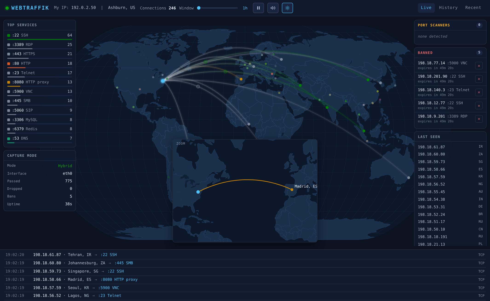

# webTraffik

A network traffic sensor and low-interaction honeypot. It listens on the ports internet scanners probe most — HTTP(S), SSH, Telnet, FTP, SMTP, Redis, databases, ICS/SCADA, crypto nodes and more — emulates just enough of each protocol to capture what attackers actually send (credentials, commands, exploit payloads, TLS fingerprints), geolocates every source (country, city, ASN) and streams it all to a live world-map dashboard. An optional eBPF/XDP layer drops banned sources in the kernel.


## Features

- **Deep capture, not just counting**: full HTTP requests (headers + body) behind a convincing nginx lookalike, TLS honeypot on 443/8443 with **JA3/JA4** fingerprints and SNI, a real **SSH** handshake that records every password and key offered, Telnet/FTP/SMTP/POP3/Redis sessions with credentials and commands, and raw client bytes for everything else
- **Classification**: payloads are tagged (`log4shell`, `path-traversal`, `env-probe`, `shell-injection`, `redis-exploit`, `mirai-default-creds`, `scanner:zgrab`, …) and counted in the metrics
- **Enrichment**: MaxMind GeoLite2 City + ASN (auto-downloaded, validated and refreshed in the background) with an `rgeo` city fallback
- **Live world map**: animated great-circle arcs, history replay, ban/unban and traceroute from the dashboard
- **Auto-ban + port-scan detection**: flood and volume-window bans per IP+port, scanner panel, persistent bans
- **eBPF/XDP (optional)**: banned IPs are dropped in the kernel (IPv4 and IPv6); per-SYN events and telemetry (multicast/broadcast LAN chatter such as mDNS is ignored, as are packets that look like replies to this host's own outbound traffic: ICMP echo replies/errors and UDP from a server port to an ephemeral port); automatic fallback to pure userspace if XDP cannot attach
- **Secure by default install**: dashboard Basic auth with a generated password, Origin/CSRF checks, hardened systemd unit, nftables DMZ policy
- **Operations**: graceful shutdown, bounded queues and connection limits, versioned DB migrations, event retention, Prometheus `/metrics`, JSON-lines export, structured (`slog`) logs, `/api/status`
- **Single binary**: pure Go (no CGo), SQLite persistence, embedded UI; linux/amd64, arm64, armv6, armv7, darwin and windows

## Architecture

```
 scanners ──► listeners (HTTP/TLS/SSH/Telnet/FTP/SMTP/POP3/Redis/banners/UDP)
                 │  Capture{src, port, payload, detail, tags, meta}
 XDP events ─────┤  (ports without a Go listener)
                 ▼
          App.Submit()  ── bounded queue (drops are counted, never blocks) ──┐
                                                                              ▼
                          workers: rate-limit/scan check → geo + ASN → ConnectionEvent
                                              │
              ┌───────────────┬──────────────┼───────────────┬────────────────┐
              ▼               ▼              ▼               ▼                ▼
         Hub (ring +     SQLite (batched   Metrics       JSONL export     /api/status
         WebSocket)      writer)           (hourly)      (optional)
```

Every port is defined once, in the registry in `internal/services/registry.go`; the listeners, the firewall port sets (`webtraffik ports`), the UI service names and [docs/PORTS.md](docs/PORTS.md) are all derived from it. See [SERVICES.md](SERVICES.md) for what each emulator does, and [AGENTS.md](AGENTS.md) for the design invariants.

The dashboard is served on port **8999** (management-only: subnet-restricted by the firewall and, on fresh installs, password protected).

Traffic reaches the app via **NAT redirect** (no proxy headers), so the connection's remote address is the real source IP. IPv4 and IPv6 are both supported.

The dashboard streams events over WebSocket (`/ws?hours=1..24`): history is replayed from SQLite first (flagged `replay`), then live events follow.

## Screenshot



*Screenshots use synthetic demo traffic (sources are in the reserved 198.18.0.0/15 benchmarking range), rendered by the real backend and UI.*

The live dashboard shows:
- A world map with your server marked in cyan, animated great-circle arcs from each source (colored by port), persistent dots, and a zoom inset for the latest arrival
- **Left**: Top Services (live counts per service) and the Capture Mode panel (mode, interface, eBPF passed/dropped packets, active bans, uptime)
- **Right**: Port Scanners, Banned IPs (with one-click unban) and Last Seen sources
- **Top bar**: connection status, your IP/location, connection count, replay-window slider (1–24 h), pause/resume, sound and theme toggles
- A scrolling log at the bottom; click any entry to replay its arc, or double-click a dot to trace the route

## History Page

The history page filters and charts stored events by country, source IP prefix, port, service and date range (with presets) — the screenshot above is filtered to one source range over the last 24 hours:
- Stat tiles (connections, unique IPs, bans with an auto/manual split, rows returned) and timelines for connections, unique IPs and bans
- Below the fold: top ports, countries, services and source IPs, per-port and per-country timelines, an eBPF capture section, and a result table with captured detail and tags
- The **Recent** page shows live hex dumps of client payloads with filters

## Quick Start

### Prerequisites

- **Go 1.21+** (for building from source)
- **Linux** (for systemd service) — also works on macOS/Windows for development
- **nftables** (for the automated firewall — Linux only)

### Build and Run Locally

```bash
# Clone the repository
git clone https://github.com/yourusername/webtraffik.git
cd webtraffik

# Build for your current platform
make build

# Run with capability (allows binding ports <1024 without root)
make cap
```

Visit http://localhost:8999 to see the dashboard.

### Install as systemd Service

On the target Linux machine:

```bash
make install
```

This will:
1. Build the binary
2. Create a system user `webtraffik`
3. Install to `/usr/local/bin/webtraffik`
4. Set `cap_net_bind_service` capability
5. Install and start the systemd service

Check logs with:

```bash
journalctl -u webtraffik -f
```

## Installation Methods

### Method 1: Local Install (requires Go and make)

```bash
make install
```

### Method 2: Remote Install via SSH

Build on your local machine and deploy to a remote host in one command:

```bash
make remote-install IP=1.2.3.4
```

This automatically:
- Detects the remote architecture
- Cross-compiles the correct binary
- Copies binary, install script, firewall script, and nftables template via SSH
- Runs the installer as root (which includes full firewall setup)

SSH connects as `$USER` — ensure your SSH key is configured on the remote host.

### Method 3: Manual Install (no Go/make on target)

For hosts without Go:

1. Build the binary for the target architecture:
   ```bash
   make dist
   ```

2. Copy to the remote host:
   ```bash
   scp dist/webtraffik_linux_amd64 user@host:webtraffik
   scp install.sh firewall.sh nftables.conf user@host:
   ```

3. Install on remote:
   ```bash
   ssh user@host
   sudo bash install.sh
   ```

## Makefile Targets

| Target | Description |
|--------|-------------|
| `make build` | Build for current OS/arch |
| `make dist` | Cross-compile for all platforms into `dist/` |
| `make run` | Build and run locally |
| `make cap` | Build, set `cap_net_bind_service`, and run |
| `make cap-dist` | Set capabilities on all Linux dist binaries |
| `make install` | Install binary + systemd service |
| `make remote-install IP=x.x.x.x` | Build, deploy, install, and configure firewall on remote host via SSH |
| `make firewall` | Re-apply nftables firewall ruleset on the local machine |
| `make uninstall` | Remove service, binary, user, data directory, and firewall config |
| `make clean` | Remove build artifacts and GeoLite2 DB |
| `make check` | gofmt + `go vet` + `go test -race` (what CI runs) |
| `make test` / `make vet` / `make fmt` | Individual checks |
| `make docs` | Regenerate `docs/PORTS.md` from the port registry |
| `make ebpf-gen` | Regenerate the committed eBPF objects/bindings from `capture.bpf.c` via `bpf2go` (requires `clang`) |
| `make ebpf-check` | Regenerate and fail if the committed eBPF artifacts differ (CI) |

## Firewall Configuration

webTraffik ships with `firewall.sh` and `nftables.conf`, which together configure an nftables DMZ policy automatically during installation.

### What the firewall does

- **Capture ports** (80, 8080, 8000, etc.) are **open to the internet** — these are the honeypot/sensor ports
- **Everything else** (SSH :22, dashboard :8999, any other service) is **restricted to your local subnet** — the subnet is auto-detected from the default route interface at install time
- The NAT prerouting rule redirects capture-port traffic to the app process

### How it is applied

`firewall.sh` runs automatically as part of `make remote-install` and `sudo bash install.sh`. It:
1. Auto-detects the primary network interface and its subnet via `ip route`
2. Substitutes `__SUBNET__` and `__CAPTURE_PORTS__` tokens in `nftables.conf`
3. Writes the generated ruleset to `/etc/nftables.d/webtraffik.conf`
4. Validates the ruleset with `nft -c` before applying
5. Enables and restarts the `nftables.service`

To re-apply without a full reinstall:

```bash
make firewall
# or
sudo bash firewall.sh
```

### Ports are generated, not synced

`firewall.sh` asks the installed binary for the port sets (`webtraffik ports -proto tcp -format nft`), so the firewall always matches what the app listens on — there is nothing to keep in sync by hand. Inspect them yourself:

```bash
webtraffik ports -proto tcp -format nft        # 21, 22, 23, ...
webtraffik ports -proto udp -format nft
webtraffik ports -format json                  # everything, with service names
```

If you disable individual ports with `-disable-ports` (for example because a real SSH daemon uses 22), pass the same list to the firewall so it does not open ports nobody serves:

```bash
sudo DISABLE_PORTS=22,443 bash firewall.sh
```

The dashboard port **8999** is intentionally not in the capture sets and is protected by the subnet-only management rule.

### Inspect the active ruleset

```bash
nft list ruleset
```

## Configuration

webTraffik is configured by a YAML file at `/etc/webtraffik/config.yaml` (created by `install.sh` from [config.yaml.example](config.yaml.example), which documents every option) and/or CLI flags. Every key has a flag of the same name.

**Precedence: CLI flag > config file > built-in default.** Unknown keys in the file are an error, so a typo cannot silently do nothing.

| Option | Default | Purpose |
|--------|---------|---------|
| `capture-mode` | `hybrid` | `hybrid` (XDP bans + Go listeners), `ebpf-only`, `go-only`. Falls back to `go-only` automatically if XDP cannot attach |
| `ebpf-iface` | auto | Interface for XDP (default route) |
| `mgmt-ports` | dashboard port + `22` | Ports XDP never drops/logs |
| `mgmt-allow-file` | – | IPs (v4/v6, one per line) that bypass XDP bans; `systemctl reload` re-reads it |
| `disable-ports` | – | Ports not to bind (real services on the host) |
| `max-conns` | `4096` | Concurrent emulated connections |
| `dashboard-listen` | `:8999` | e.g. `127.0.0.1:8999` behind a reverse proxy |
| `dashboard-user` / `dashboard-pass-file` | – | Enable HTTP Basic auth (or `$WEBTRAFFIK_DASHBOARD_PASS`) |
| `allowed-origins` | – | Extra Origin hosts (your reverse proxy name) for WebSocket/POST |
| `data-dir` | working dir | Database, geo files, SSH host key, TLS certificate |
| `retention-days` | `90` | Delete events older than this (`0` keeps everything; metrics are kept) |
| `export-jsonl` / `export-max-mb` | – / `100` | Append every event as a JSON line, rotating at the size limit |
| `public-ip` | auto | Override discovery; `none` skips it |
| `disable-rgeo`, `disable-asn` | `false` | Skip the city fallback / ASN enrichment (faster start on a Pi) |
| `geo-refresh` | `168h` | Background refresh of the geo databases (`0` disables); downloads are validated and swapped atomically |
| `geo-city-url`, `geo-asn-url`, `geo-city-sha256` | public mirror | Where to fetch the databases; optionally pin the City download |
| `log-level`, `log-format` | `info`, `text` | `debug` logs every connection; `json` for log pipelines |

```bash
webtraffik -config=/path/to/config.yaml     # alternate file
webtraffik -help                            # every flag
webtraffik ports -format json               # what will be bound
webtraffik version
```

### Reloading

`systemctl reload webtraffik` (SIGHUP) re-reads `mgmt-allow-file` only; everything else needs `systemctl restart webtraffik`. `SIGTERM`/`SIGINT` trigger a graceful shutdown: listeners close, queued events are processed, metrics and the DB are flushed and the XDP program is detached.

## File Structure

```
webtraffik/
├── cmd/webtraffik/          # main, flags/config, `ports` subcommand
├── internal/
│   ├── app/                 # capture pipeline, workers, shutdown, status, JSONL export
│   ├── server/              # dashboard HTTP: auth, API, WebSocket, traceroute SSE
│   ├── services/            # port registry + all listeners and protocol emulators
│   ├── ebpf/                # XDP program (C), loader/manager, committed objects
│   ├── ratelimit/           # auto-ban, port-scan detection
│   ├── db/                  # SQLite, migrations, retention
│   ├── geo/                 # GeoLite2 City/ASN, validated refresh
│   ├── hub/ event/ metrics/ traceroute/ iputil/ testutil/
├── web/                     # frontend source
├── docs/PORTS.md            # generated port reference
├── firewall.sh, nftables.conf, install.sh, webtraffik.service
├── config.yaml.example, Makefile
└── README.md, SERVICES.md, AGENTS.md
```

## How It Works

### Geolocation Pipeline

1. **GeoLite2 City + ASN**: country, city, coordinates, accuracy radius, AS number and organisation. The databases are downloaded on first run, refreshed weekly with a conditional request, validated (size, MaxMind format, optional SHA-256) and swapped in atomically.
2. **rgeo fallback**: when GeoLite2 has coordinates but no city name, `rgeo` reverse-geocodes the nearest city from embedded datasets. It initialises in the background; early lookups simply skip it.

### Event Flow

See the diagram under [Architecture](#architecture). Capture is non-blocking end to end: listeners hand a `Capture` to a bounded queue, workers enrich and fan it out, the DB writer batches inserts, and a full queue drops (and counts) rather than stalling the network path.

### Dashboard

The UI is a Vite + TypeScript app in [`web/`](web/README.md) (D3 map, live/history/recent pages). It is built to `web/dist`, which is **committed and embedded** in the binary, so `go build` needs no Node. Everything is self-hosted — no CDN requests, which also lets the strict Content-Security-Policy stay tight. Highlights: dark/light themes, pause/resume, replay-window slider (1–24 h), auto-reconnecting WebSocket, keyboard/ARIA support, mobile drawers, traceroute visualisation with country-level and RTT-implausibility filtering, ban/unban from tooltips and the Banned panel.

Frontend workflow: `make web` rebuilds `web/dist` (commit the result), `make web-check` runs typecheck + lint + unit tests, `cd web && npm run dev` serves with hot reload proxying to a running backend on :8999.

## Dependencies

### Go Modules

- `github.com/oschwald/geoip2-golang` — MaxMind DB reader
- `github.com/sams96/rgeo` — embedded reverse geocoder
- `nhooyr.io/websocket` — WebSocket server
- `modernc.org/sqlite` — pure-Go SQLite driver (no cgo)
- `github.com/cilium/ebpf` — XDP loading, perf buffer (Linux)
- `golang.org/x/crypto/ssh` — SSH honeypot handshake
- `gopkg.in/yaml.v3` — config

### Frontend (bundled from npm, build-time only)

D3, topojson-client and the `sane-topojson` world map are bundled into `web/dist`; Vite, TypeScript, Vitest and Playwright are dev dependencies. See [web/README.md](web/README.md).

## Cross-Compilation

The Makefile supports all major platforms:

| Target | Build Command | Notes |
|--------|---------------|-------|
| linux/amd64 | `make linux/amd64` | Standard x86_64 Linux |
| linux/arm64 | `make linux/arm64` | Pi 3B+, Pi 4, Pi 5, modern ARM servers |
| linux/armv6 | `make linux/armv6` | Pi Zero, Pi 1 (32-bit hard-float) |
| linux/armv7 | `make linux/armv7` | Pi 2, Pi 3 (32-bit), Pi Zero 2 W |
| darwin/amd64 | `make darwin/amd64` | Intel Mac |
| darwin/arm64 | `make darwin/arm64` | Apple Silicon (M1/M2/M3) |
| windows/amd64 | `make windows/amd64` | 64-bit Windows |
| windows/arm64 | `make windows/arm64` | ARM Windows |

Build all platforms:

```bash
make dist
```

Binaries appear in `dist/` as `webtraffik_<os>_<arch>[.exe]`.

## Systemd Service Details

The service runs as a dedicated `webtraffik` system user with minimal privileges:

- **User/Group**: `webtraffik:webtraffik`
- **Capabilities**: `CAP_NET_BIND_SERVICE` (bind ports <1024) plus `CAP_BPF`, `CAP_NET_ADMIN` and `CAP_PERFMON` for the eBPF modes (kernel ≥ 5.8). `CAP_SYS_ADMIN` is **not** needed: without `CAP_PERFMON` the BPF verifier rejects the program's pointer arithmetic for non-root users, and with it the program loads (verified unprivileged). The app falls back to `go-only` if loading fails.
- **Memory lock**: `LimitMEMLOCK=infinity` — required for eBPF map allocation
- **Sandboxing**: `ProtectSystem=strict`, `ProtectHome`, `PrivateTmp`, `NoNewPrivileges`, `ProtectKernel{Modules,Logs}`, `ProtectControlGroups`, `ProtectClock`, `LockPersonality`, `RestrictRealtime`, `RestrictSUIDSGID`
- **Reload/stop**: `ExecReload` sends SIGHUP (allow-list reload); `systemctl stop` sends SIGTERM and waits up to 30 s for the graceful shutdown
- **Working Directory**: `/var/lib/webtraffik` (writable for GeoLite2 DB download and SQLite database)
- **Auto-Restart**: `Restart=on-failure` with 5s delay

View service status:

```bash
systemctl status webtraffik
```

Restart service:

```bash
sudo systemctl restart webtraffik
```

Stop service:

```bash
sudo systemctl stop webtraffik
```

## Security Considerations

- **Dashboard authentication**: set `dashboard-user` and `dashboard-pass-file` (fresh installs generate a password for you). Without it the dashboard relies solely on the firewall and logs a warning at startup. It speaks plain HTTP — put it behind a TLS reverse proxy (set `dashboard-listen: 127.0.0.1:8999` and `allowed-origins`) if you reach it across untrusted networks.
- **Cross-site protection**: state-changing endpoints (`/api/ban`, `/api/unban`) require `Content-Type: application/json` and reject requests whose `Origin` is not the dashboard's own host; the WebSocket checks the Origin too. Inputs are validated (IP/port), and traceroute is limited to public addresses with at most two concurrent runs.
- **Public ports**: capture ports are meant to be exposed to the internet. Emulators are low-interaction: no shell is ever granted, the SSH server rejects every authentication attempt, and all parsers bound the input they read. The connection limit (`max-conns`) and per-session deadlines cap resource use.
- **Firewall required**: without `firewall.sh`, SSH and the dashboard are exposed. Run it on internet-facing hosts.
- **Captured data is sensitive-ish**: attackers' passwords and payloads are stored in `events.db` (and the optional JSONL export) and logged at `debug` level. Treat the data directory accordingly and set `retention-days` to match your policy.
- **Supply chain**: the GeoLite2 databases come from a third-party mirror by default. Pin the City download with `geo-city-sha256`, or host the files yourself (`geo-city-url`). The UI is fully self-hosted (no CDN requests).
- **Resource limits**: in memory, the history ring holds 1000 events and the capture queue 8192; on disk, `retention-days` (default 90) prunes old events.

## Port Conflicts & Warnings

**⚠️ CRITICAL: webTraffik binds to many well-known service ports by default.**

webTraffik listens on common ports including **22 (SSH)**, **80 (HTTP)**, **443 (HTTPS)**, **3306 (MySQL)**, **5432 (PostgreSQL)**, **6379 (Redis)**, and many others (see Architecture section above for full list).

### The Risk

1. **Bind Failure**: If a port is already in use by a real service on the host, webTraffik will log a warning and skip that port. The app continues running but will not capture traffic on that port.

2. **Firewall Exposure** (more critical): The nftables firewall opens **all** configured capture ports to the entire internet by default. If you have a real service running on one of those ports (e.g., a real SSH daemon on :22), **the firewall will expose it to the internet**, bypassing the subnet-only management rule that normally protects it.

### Solution

**You MUST use `-disable-ports` to exclude any port that runs a real service**, and pass `DISABLE_PORTS=` to `firewall.sh` so the firewall rule is also excluded.

#### Example: Protecting a Real SSH Server on Port 22

If your host runs a real SSH server on port 22:

1. **Edit the systemd service** to disable port 22 in the app:
   ```bash
   sudo systemctl edit webtraffik --full
   ```
   Change the `ExecStart` line to:
   ```
   ExecStart=/usr/local/bin/webtraffik -disable-ports=22
   ```
   Or, to also skip rgeo loading for faster startup on slow hardware:
   ```
   ExecStart=/usr/local/bin/webtraffik -disable-ports=22 -disable-rgeo
   ```
   Save and reload:
   ```bash
   sudo systemctl daemon-reload
   sudo systemctl restart webtraffik
   ```

2. **Re-apply the firewall** with the same port exclusion:
   ```bash
   sudo DISABLE_PORTS=22 bash firewall.sh
   ```

This ensures:
- webTraffik will not attempt to bind to port 22
- The nftables firewall will not open port 22 to the internet (it remains protected by the subnet-only rule)

#### Multiple Ports

To disable multiple ports, use a comma-separated list:

```bash
# In systemd unit:
ExecStart=/usr/local/bin/webtraffik -disable-ports=22,80,443

# In firewall:
sudo DISABLE_PORTS=22,80,443 bash firewall.sh
```

**Always verify your configuration** after applying changes:
- Check listening ports: `ss -tlnp | grep webtraffik`
- Check firewall rules: `nft list ruleset`

## Troubleshooting

### Dashboard shows no connections

- **Check firewall rules**: Ensure NAT redirect is active (`nft list ruleset`)
- **Check capture ports**: Verify the app is listening on expected ports (`ss -tlnp | grep webtraffik`)
- **Check public IP**: Ensure discovery succeeded (check the logs), or set `public-ip` explicitly
- **Check the status endpoint**: `curl -u admin:… http://host:8999/api/status` shows handled/dropped events, queue depth and rejected connections

### GeoLite2 download fails

- **Manual download**: Place `GeoLite2-City.mmdb` (and optionally `GeoLite2-ASN.mmdb`) in the data directory before starting
- **Mirror URL**: set `geo-city-url` / `geo-asn-url` in the config to another source; downloads are rejected if they are too small or not a valid MaxMind database

### Service fails to start

- **Check logs**: `journalctl -u webtraffik -e`
- **Check permissions**: Ensure `/var/lib/webtraffik` is owned by `webtraffik:webtraffik`
- **Check capabilities**: Verify `cap_net_bind_service` is set on the binary: `getcap /usr/local/bin/webtraffik`

### WebSocket reconnects constantly

- **Check browser console**: Look for connection errors
- **Check port 8999**: Ensure it's reachable from your IP: `curl http://localhost:8999`
- **Check subnet restriction**: If accessing from outside the management subnet, the firewall will block port 8999
- **Check reverse proxy**: If behind nginx/apache, ensure WebSocket upgrade headers are forwarded

### Firewall blocks dashboard access

- **Check your source IP**: `curl ifconfig.me` — it must be within the subnet shown by `nft list ruleset`
- **Re-apply with correct subnet**: If the auto-detected subnet is wrong, edit `firewall.sh` and re-run `sudo bash firewall.sh`

### eBPF XDP fails to attach

- **Check kernel version**: XDP requires Linux ≥5.10. Check with `uname -r`.
- **Check capabilities**: The service unit must include `CAP_BPF`, `CAP_NET_ADMIN` and `CAP_PERFMON` in both `AmbientCapabilities` and `CapabilityBoundingSet`, plus `LimitMEMLOCK=infinity` (the shipped unit does). A verifier error like `R2 has pointer with unsupported alu operation ... prohibited for !root` means `CAP_PERFMON` is missing. Kernels older than 5.8 have no `CAP_BPF`/`CAP_PERFMON`; they need `CAP_SYS_ADMIN` instead.
- **Check the eBPF program loads**: `go test -run TestProgramLoads ./internal/ebpf` (as the service user / with the same capabilities) runs the object through the kernel verifier.
- **Check interface**: Ensure `-ebpf-iface` matches an active interface: `ip link show`. If unset, auto-detection uses the default route interface.
- **Automatic fallback**: On attach failure, webTraffik automatically falls back to `go-only` mode (all Go listeners still work). Check logs: `journalctl -u webtraffik -e | grep ebpf`
- **Driver compatibility**: Some virtual/cloud NICs do not support XDP native mode. The app uses generic (SKB) mode as fallback — it always works but has slightly higher overhead.
- **Docker/container**: Requires `--cap-add=BPF --cap-add=NET_ADMIN --cap-add=PERFMON` and `--network=host` (XDP does not work with bridged container networking in most CNI setups).

### eBPF on Raspberry Pi / kernels without BTF

The XDP program is built against the stable kernel UAPI headers (no `vmlinux.h`, no CO-RE relocations), so it does **not** need `/sys/kernel/btf/vmlinux`. Stock Raspberry Pi OS kernels (no `CONFIG_DEBUG_INFO_BTF`) work without swapping kernels or generating BTF — this was verified on a kernel with an empty `/sys/kernel/btf/`. What is required is Linux ≥ 5.10 and the capabilities listed under *Systemd Service Details*.

## Development

### Running Locally (macOS/Linux)

```bash
# Build and run
make run
```

Port 8999 will be accessible on `localhost`. Capture ports (80, etc.) will fail unless run with `sudo` or `make cap`.

### Running Locally (Windows)

```bash
go build -o webtraffik.exe .
.\webtraffik.exe
```

Ports <1024 require Administrator privileges on Windows.

### Frontend hot reload

Run a backend (`./webtraffik -capture-mode=go-only -dashboard-listen=127.0.0.1:8999`), then `cd web && npm run dev` — the Vite dev server on :5173 proxies `/api` and `/ws` to it. Run `make web` and commit `web/dist` when done.

## Uninstall

```bash
make uninstall
```

This removes:
- systemd service
- binary (`/usr/local/bin/webtraffik`)
- data directory (`/var/lib/webtraffik`) including the SQLite database
- system user (`webtraffik`)
- nftables config (`/etc/nftables.d/webtraffik.conf`)

## License

MIT License — see [LICENSE](LICENSE) for details.

## Credits

- **MaxMind GeoLite2**: Free geolocation database (via [P3TERX/GeoLite.mmdb](https://github.com/P3TERX/GeoLite.mmdb) mirror)
- **rgeo**: Embedded reverse geocoder by [@sams96](https://github.com/sams96/rgeo)
- **D3.js**: Data-driven visualization library
- **Natural Earth**: Public domain map data

## Contributing

Contributions welcome! Please open an issue or pull request.

## Support

For issues or questions:
- Open a [GitHub Issue](https://github.com/jlmeeker/webtraffik/issues)
- Check logs: `journalctl -u webtraffik -f`
- Review [Troubleshooting](#troubleshooting) section

---

**Built with Go + D3.js** — Visualize your web traffic in real-time.
